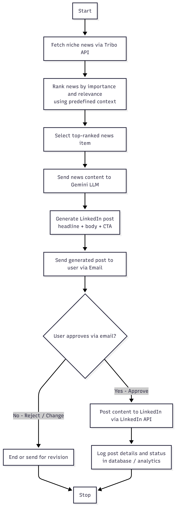

# 🚀 AI-Powered LinkedIn Automation System

This project automates professional LinkedIn posting using **GenAI**, news intelligence, and smart workflows. It enables continuous LinkedIn engagement without manual effort.

---

## 🧠 What This Project Does

The system:

1️⃣ Fetches fresh, niche-related news using the **Tribo API**
2️⃣ Ranks news on importance + predefined context relevance (**LangGraph workflow**)
3️⃣ Converts the top news into a high-quality LinkedIn post using **Google Gemini**
4️⃣ Emails the post to the user for approval
5️⃣ After a simple reply "Approve", automatically publishes the post using **LinkedIn API**
6️⃣ Logs the published post for analytics

This creates a **hands-free LinkedIn growth engine** for busy professionals and founders.

---

## ✨ Key Features

| Feature                  | Description                               |
| ------------------------ | ----------------------------------------- |
| Autonomous post creation | News → AI → LinkedIn                      |
| Context-aware relevance  | Ensures only niche-specific topics        |
| Smart approval loop      | Publish only when user approves           |
| AI-generated content     | Polished headlines, body text & CTA       |
| End-to-End flow          | From news fetch to published post         |
| Expandable               | Can integrate dashboards, analytics, etc. |

---

## 🔁 System Architecture

Below is the visual flowchart for the automation workflow 👇



---

## 🧩 Tech Stack

| Area                   | Tech                     |
| ---------------------- | ------------------------ |
| AI Model               | Google Gemini            |
| Workflow Orchestration | LangGraph                |
| Search & Relevance     | Tavily API               |
| News Source            | Tribo API                |
| Environment Config     | python-dotenv            |
| Backend                | Python (Flask / FastAPI) |
| Email                  | Gmail SMTP / API         |
| Automation             | LinkedIn API             |

---

## 📦 Installation

Clone the repo:

```bash
git clone https://github.com/<your-username>/<repo-name>.git
cd <repo-name>
```

Install dependencies:

```bash
pip install -r requirements.txt
```

---

## 🔐 Environment Setup

Create a `.env` file and add your credentials:

```env
GEMINI_API_KEY=
TAVILY_API_KEY=
TRIBO_API_KEY=
LINKEDIN_CLIENT_ID=
LINKEDIN_CLIENT_SECRET=
EMAIL_USER=
EMAIL_PASSWORD=
```

---

## ▶️ Running the Application

Start your server:

```bash
python app.py
```

Automation will auto-publish to LinkedIn once user approves via email 🎯

---

## 🚀 Future Enhancements

* Multi-user system with login
* Dashboard & analytics (CTR, Impressions, Engagement patterns)
* Auto-content revision if user rejects
* Scheduling (Daily/Weekly posting)
* Personalization based on audience interaction

---

## 🤝 Contributing

Pull requests are welcome! For major changes, open an issue first to discuss.

---

## 📧 Contact

**Author:** Sarthak Pande
**Email:** *sarthakpande1008@gmail.com*


---

⭐ If this project helped or inspired you, please give it a Star!
